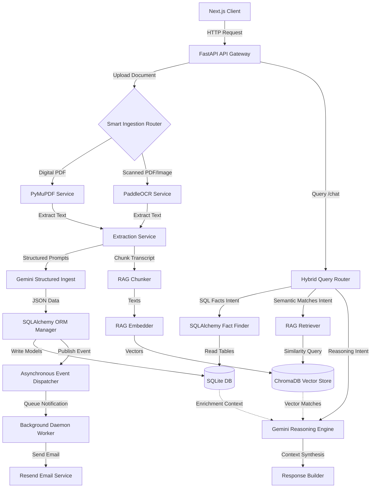

# IntelliMeet Backend Services Architecture

Welcome to the IntelliMeet backend services documentation. This project acts as the high-performance core for the **IntelliMeet: AI-Powered Meeting Intelligence & Escalation Tracking System**. It is built on a clean service-oriented, event-driven pattern designed for sub-second responses, reliable RAG queries, and decoupled transactional alerts.

---

## 🏗️ Core Architecture Overview



---

## 🛠️ Technology Stack

1. **API Gateway & Routing**: [FastAPI](https://fastapi.tiangolo.com/) (Asynchronous, high performance).
2. **Relational Database**: [SQLite](https://www.sqlite.org/) managed via **SQLAlchemy 2.0 ORM** (declarative sessions, explicit SQLite foreign key constraints enabled on connection).
3. **Vector Database**: [ChromaDB](https://www.trychroma.com/) for semantic search across 5 collections (`meeting_chunks`, `meeting_summaries`, `risks`, `escalations`, `decisions`).
4. **AI/LLM Engine**: [Gemini 2.5 Flash](https://deepmind.google/technologies/gemini/) (structured JSON extraction and complex context QA).
5. **Local Vector Embedder**: [SentenceTransformers (`all-MiniLM-L6-v2`)](https://huggingface.co/sentence-transformers/all-MiniLM-L6-v2) for local, cost-free document embedding.
6. **Smart Document Processor**:
   - **PyMuPDF**: Fast native text extractor for digital vector PDFs.
   - **PaddleOCR**: Local Deep-Learning OCR pipeline for scanned assets or images.
7. **Alert Notifications**: [Resend Email API](https://resend.com/) with asynchronous simulation fallback.

---

## 📂 Backend Directory Structure

The backend structure enforces strict separation of concerns, ensuring single responsibility per component:

```
backend/
├── app/
│   ├── database/             # Relational schema mappings and connections
│   │   ├── db.py             # SQLite engines, session bindings, foreign keys activator
│   │   ├── models.py         # SQLAlchemy Base models (Employee, Meeting, Project, etc.)
│   │   ├── schema.py         # Pydantic validation schemas
│   │   └── seed.py           # Employee seeds with active emails
│   │
│   ├── events/               # Event declarations and listeners
│   │   ├── dispatcher.py     # Asynchronous worker queue mediator
│   │   └── events.py         # Declared Event dataclasses
│   │
│   ├── notifications/        # Out-of-band email and alerts service
│   │   ├── notification_service.py # User-facing notification api
│   │   ├── resend_service.py # Resend client integration
│   │   └── templates.py      # Styled HTML templates
│   │
│   ├── prompts/              # Strict text system instructions
│   │   ├── extraction.txt    # Ingestion prompt (forces clean JSON)
│   │   └── qa.txt            # System instructions for narrative QA
│   │
│   ├── rag/                  # Modular Retrieval-Augmented Generation
│   │   ├── chroma_service.py # ChromaDB low-level collection manager
│   │   ├── chunker.py        # Text chunker and overlap validator
│   │   ├── embedder.py       # SentenceTransformers local client wrapper
│   │   ├── retriever.py      # Vector search context builder
│   │   └── response_builder.py # Formatting tables and Gemini syntheses
│   │
│   ├── routes/               # API endpoint router groups
│   │   ├── chat.py           # Chat gateway routing query
│   │   ├── escalations.py    # Escalations endpoints
│   │   ├── meetings.py       # Meetings endpoints
│   │   ├── risks.py          # Risks endpoints
│   │   └── upload.py         # File/OCR parser and extraction trigger
│   │
│   └── main.py               # Application startup and listener bootstraps
│
├── tests/                    # Testing suite
│   └── test_integration.py   # Complete end-to-end flow validator
│
├── requirements.txt          # Python packaging manifest
└── .env                      # API keys and configurations
```

---

## 📡 API Endpoints Reference

All API routes are prefixed under `/api`.

### 1. Document Upload & Ingestion
* **`POST /api/upload`**
  - **Form Fields**: 
    - `title` (string, required): Title of the meeting.
    - `project` (string, required): Target project name.
    - `text` (string, optional): Pasted transcript text.
    - `file` (binary, optional): PDF document, scanned PDF, or image file.
  - **Behavior**:
    1. If `file` is provided, routes to PyMuPDF (if digital) or PaddleOCR (if image/scanned PDF). Otherwise, uses pasted `text`.
    2. Calls Gemini API in JSON Mode with a structured prompt.
    3. Commits meeting and extracted models (tasks, risks, decisions, escalations) to SQLite database using SQLAlchemy.
    4. Computes embeddings locally using SentenceTransformers, saving chunks to ChromaDB.
    5. Publishes background events (`TaskAssignedEvent`, `CriticalEscalationEvent`) to trigger emails.
  - **Response (200 OK)**:
    ```json
    {
      "status": "success",
      "message": "Meeting successfully processed and saved.",
      "data": {
        "meeting_id": 12,
        "project_name": "Project Apollo",
        "risk_score": 42.5,
        "status": "At Risk",
        "summary": "Meeting summary...",
        "extracted_data": { "tasks": [...], "risks": [...], "escalations": [...], "decisions": [...] }
      }
    }
    ```

### 2. Meetings Management
* **`GET /api/meetings`**
  - **Behavior**: Retrieves a chronological list of all processed meetings, including overall projects and summaries.
* **`GET /api/meetings/{id}`**
  - **Behavior**: Retrieves specific details of a meeting, returning the relational objects mapped to it (associated tasks, risks, escalations, and decisions).

### 3. Risk & Escalation Dashboards
* **`GET /api/risks`**
  - **Behavior**: Lists all identified project threats and active risks.
* **`GET /api/escalations`**
  - **Behavior**: Lists unresolved project roadblocks and assigned critical escalations.

### 4. Smart Chat & Query Gateway
* **`POST /api/chat`**
  - **Request Body**:
    ```json
    {
      "query": "Show pending tasks for Yashank"
    }
    ```
  - **Behavior**: Invokes the **Hybrid Query Router** to classify the query's intent (SQL vs. Semantic vs. Reasoning).
  - **Response (200 OK)**:
    ```json
    {
      "intent": "SQL_QUERY",
      "query": "Show pending tasks for Yashank",
      "sql_trace": {
        "query": "session.query(Task).filter(...).limit(15)",
        "params": []
      },
      "semantic_results": null,
      "response": "### SQLite Relational Facts (Tasks)\n\n| ID | Title | Assignee | Due Date | Status | Project |\n|---|---|---|---|---|---|\n| 1 | AI Anomaly Alerts | Yashank Gupta | 2026-06-15 | Pending | Apollo |"
    }
    ```

---

## 🔄 Ingestion & Extraction Data Flow

The meeting ingestion flow handles messy inputs and translates them to structured knowledge:

```
[Raw Document / Text Input]
            │
            ▼
┌───────────────────────┐
│ Smart Document Router │
└───────────┬───────────┘
            │
      ┌─────┴──────────────────────────────────┐
      ▼ (Pasted Text / Digital PDF)            ▼ (Scanned PDF / Image / Photograph)
┌───────────┐                            ┌───────────┐
│  PyMuPDF  │                            │ PaddleOCR │
└─────┬─────┘                            └─────┬─────┘
      │                                        │
      └──────────────────┬─────────────────────┘
                         ▼ [Cleaned Text String]
              ┌───────────────────────┐
              │ Gemini Structured API │  <-- Using JSON Mode, guided by /prompts/extraction.txt
              └──────────┬────────────┘
                         ▼ [Structured JSON Document]
              ┌───────────────────────┐
              │   SQLAlchemy Commit   │  <-- Writes Meeting, Tasks, Risks, Escalations, etc.
              └──────────┬────────────┘
                         │
         ┌───────────────┴───────────────┐
         ▼ (Background Publishing)       ▼ (Semantic Vector Ingestion)
┌──────────────────┐            ┌──────────────────┐
│ Event Dispatcher │            │   RAG Chunker    │
└────────┬─────────┘            └────────┬─────────┘
         ▼                               ▼ [Transcript Paragraph Segments]
┌──────────────────┐            ┌──────────────────┐
│  Notify Assignee │            │   RAG Embedder   │ <-- Local SentenceTransformers (all-MiniLM-L6-v2)
└──────────────────┘            └────────┬─────────┘
                                         ▼ [Vector Arrays]
                                ┌──────────────────┐
                                │ ChromaDB Insert  │ <-- Indexed into chroma_db folder
                                └──────────────────┘
```

---

## ⚡ Hybrid Query Engine

To optimize performance, reduce LLM API cost, and guarantee fact accuracy, query processing does not call Gemini blindly. Instead, the backend routes queries through a multi-tier interpreter:

1. **SQL Intent (Relational Facts)**:
   - *Example Queries*: `"Show tasks due for Rahul"`, `"Show open escalations for Apollo"`, `"List risks"`.
   - *Action*: The router parses the query keywords. It maps the query to SQLAlchemy filters, bypassing the LLM. It generates a markdown table directly from the SQLite database.
2. **Semantic Intent (Vector Search)**:
   - *Example Queries*: `"What did they say about the cloud database?"`, `"Details on API timeouts"`.
   - *Action*: Embeds the query and queries ChromaDB vector collections. Returns direct matching transcript snippets alongside their metadata.
3. **Reasoning Intent (Deep RAG Synthesis)**:
   - *Example Queries*: `"Why is project Apollo at risk?"`, `"Summarize checkout stability status"`.
   - *Action*: Retrieves context from ChromaDB (meeting chunks, summaries) and fetches active risks and open escalations from SQLite. Feeds this combined context to Gemini 2.5 Flash to synthesize a deep narrative response.

---

## 📧 Event-Driven Asynchronous Notifications

Alert emails are fully decoupled from API request-response loops using a background publisher/subscriber system:

1. **Publisher**: When new tasks or escalations are committed during database ingestion, the service publishes event dataclasses (`TaskAssignedEvent`, `CriticalEscalationEvent`) to an asynchronous `EventDispatcher`.
2. **Subscriber**: The `EventDispatcher` runs an independent background thread. It queues tasks and processes them sequentially without delaying the user's API response.
3. **Resend Connector**: The worker thread uses `NotificationService` to construct templates and request delivery from Resend. If the `RESEND_API_KEY` is missing or fails (e.g. during sandbox testing), it automatically logs a detailed terminal simulation fallback.
